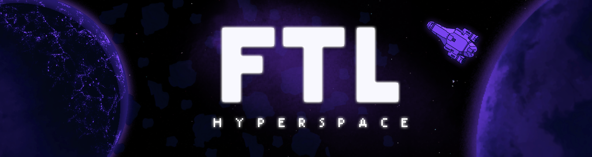

Hyperspace is a binary mod for FTL: Faster Than Light that lets modders build what FTL modding could not do before: custom alien races, new systems, augments, drones and stores, a [command console](https://ftl-hyperspace.github.io/FTL-Hyperspace/en/console/) and Lua scripting. Mods like FTL: Multiverse and Insurrection+ are built on it.

It also improves the vanilla game out of the box, with seeded runs, numerical hull, better tooltips, star map connections, right-click door opening, bug fixes and faster loading. See [all features](https://ftl-hyperspace.github.io/FTL-Hyperspace/en/features/).

## Installation

Follow the guide for your platform on the [Hyperspace website](https://ftl-hyperspace.github.io/FTL-Hyperspace/en/):
[Windows](https://ftl-hyperspace.github.io/FTL-Hyperspace/en/windows/) ·
[macOS](https://ftl-hyperspace.github.io/FTL-Hyperspace/en/macos/) ·
[Linux](https://ftl-hyperspace.github.io/FTL-Hyperspace/en/linux/) ·
[SteamOS](https://ftl-hyperspace.github.io/FTL-Hyperspace/en/steamos/)

Downloads are on the [latest release](https://github.com/FTL-Hyperspace/FTL-Hyperspace/releases/latest).

## Modding

Every setting is documented in `data/hyperspace.xml` inside `Hyperspace.ftl`. Change it from your mod with `hyperspace.xml.append`. Lua scripting is covered by the [Lua API reference](../../wiki/Lua-API).

## Building

- [Building on Windows](../../wiki/Building-on-Windows)
- [Building on Linux](../../wiki/Building-on-Linux)
- [Building on macOS](../../wiki/Building-on-MacOS)
- [Building with the devcontainer](../../wiki/Building-with-Devcontainer)

## Contributing

Start with [Contributing to Hyperspace](../../wiki/Contributing-to-Hyperspace) and the [cross-platform code guidelines](../../wiki/Cross-Platform-Code-Guidelines). [Source Structure](../../wiki/Source-Structure) explains where code goes. Set up [EditorConfig](https://editorconfig.org/) in your editor.

Questions are welcome on [Discord](https://discord.gg/hhs5ecx).

## Star History

<a href="https://www.star-history.com/#FTL-Hyperspace/FTL-Hyperspace&Date">
  <picture>
    <source media="(prefers-color-scheme: dark)" srcset="https://api.star-history.com/svg?repos=FTL-Hyperspace/FTL-Hyperspace&type=Date&theme=dark" />
    
  </picture>
</a>

## License

See [LICENSE.md](LICENSE.md) for the Hyperspace license and the licenses of bundled libraries.

Korean translation is unofficial, not from Subset Games. 
한국어 번역은 Subset Games 에서 제공하지 않은 비공식 번역입니다.

### Special Thanks

Special thanks to Kilburn for his original contribution of ZHL that provides Hyperspace with the core ability to hook functions.
