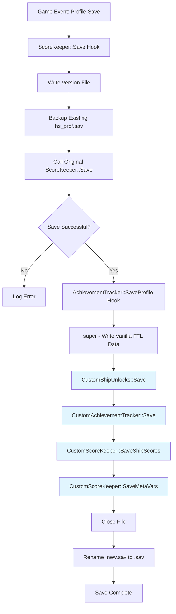
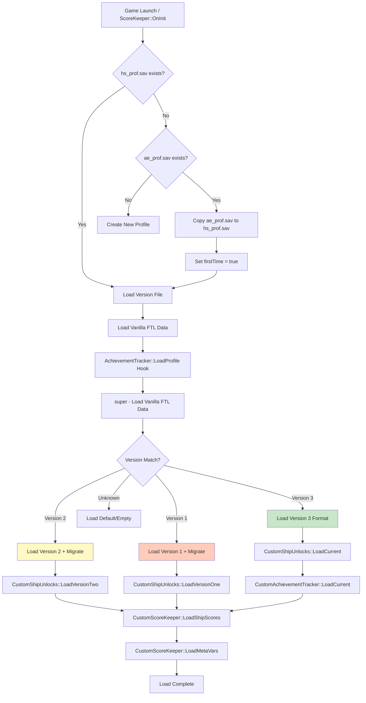
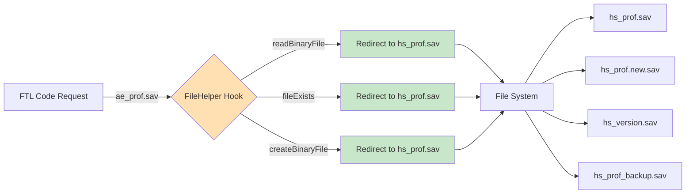

# FTL Hyperspace Profile Save Format Documentation

## Overview

The **Hyperspace Profile Save Format** (`hs_prof.sav`) extends FTL's original achievement profile format (`ae_prof.sav`) with four additional data blocks to support custom ships, achievements, scoring, and meta-variables. The file maintains full backward compatibility with vanilla FTL saves by preserving all original data structures before appending Hyperspace-specific data.

## File Metadata

| Property | Value |
|----------|-------|
| **File Extension** | `hs_prof.sav` (configurable prefix, default: `hs`) |
| **Endianness** | Little-Endian |
| **String Encoding** | 4-byte length prefix + UTF-8 data |
| **Vanilla Version** | 4-9 |
| **Hyperspace Version** | 3 |
| **File Type** | Binary |

## Binary Structure Overview

```
+--------------------------+
|   VANILLA FTL DATA       |
|   (ae_prof.sav format)   |
+--------------------------+
| version                  | s4
| opened_list              | s4
| achievements             | achievement_block
| ship_unlocks             | 12 x ship_unlock_layout
| top_scores               | score_block
| ship_scores              | score_block
| lifetime_stats           | 4 x lifetime_stat
| games_played             | s4
| victories                | s4
| crew_stats               | 5 x crew_stat
+--------------------------+
|   HYPERSPACE EXTENSIONS  |
+--------------------------+
| custom_ship_unlocks      | custom_ship_unlocks_block
| custom_achievements      | custom_achievements_block
| custom_ship_scores       | custom_ship_scores_block
| meta_variables           | meta_variables_block
+--------------------------+
```

---

## Save/Load Flow Diagrams

### Save Operation Flow



### Load Operation Flow



### File I/O Redirection Flow



---

## Detailed Field Documentation

### Vanilla FTL Data Section

#### 1. version (s4)
- **Offset**: 0x00
- **Type**: int32
- **Description**: File format version (4-9)
- **Purpose**: Vanilla format compatibility identifier

#### 2. opened_list (s4)
- **Offset**: 0x04
- **Type**: int32
- **Description**: Bitfield of opened ship layouts
- **Purpose**: Tracks which ship layouts have been viewed in selection screen

#### 3. achievements (achievement_block)
- **Offset**: 0x08
- **Type**: achievement_block
- **Description**: Vanilla achievement data
- **Structure**:
  - `length` (s4): Number of achievements
  - `entries[]` (achievement): Array of achievement entries
    - `name` (len_str): Achievement ID
    - `difficulty_or_value` (s4): Progress/difficulty value
    - `ship_difficulties` (optional): For VICTORY achievements only
      - `layout_a` (s4): Kestrel victory status
      - `layout_b` (s4): Layout B victory status
      - `layout_c` (s4): Layout C victory status

#### 4. ship_unlocks (12 × ship_unlock_layout)
- **Type**: ship_unlocks
- **Description**: Ship unlock status for 12 ship slots
- **Per-Ship Structure**:
  - `layout_a` (s4): Layout A unlock status (0=false, 1=true)
  - `layout_c` (s4): Layout C unlock status (0=false, 1=true)
- **Note**: Layout B is calculated at runtime from quest/victory achievements

**Ship Slots**:
| Index | Ship Name | Blueprint ID |
|-------|-----------|--------------|
| 0 | Kestrel | PLAYER_SHIP_HARD |
| 1 | Stealth | PLAYER_SHIP_STEALTH |
| 2 | Mantis | PLAYER_SHIP_MANTIS |
| 3 | Engi | PLAYER_SHIP_CIRCLE |
| 4 | Federation | PLAYER_SHIP_FED |
| 5 | Slug | PLAYER_SHIP_JELLY |
| 6 | Rock | PLAYER_SHIP_ROCK |
| 7 | Zoltan | PLAYER_SHIP_ENERGY |
| 8 | Crystal | PLAYER_SHIP_CRYSTAL |
| 9 | Lanius | PLAYER_SHIP_ANAEROBIC |
| 10 | Reserved | - |
| 11 | Reserved | - |

#### 5. top_scores (score_block)
- **Type**: score_block
- **Description**: Top scores across all ships
- **Structure**:
  - `length` (s4): Number of score entries
  - `entries[]` (ship_score): Array of scores
    - `ship_name` (len_str): Captain name
    - `blueprint` (len_str): Ship blueprint ID
    - `final_score` (s4): Score achieved
    - `sector_reached` (s4): Highest sector
    - `victory_flag` (s4): Victory achieved (0/1)
    - `difficulty` (s4): Difficulty (0=easy, 1=normal, 2=hard)
    - `advanced_content` (s4): DLC enabled (0/1)

#### 6. ship_scores (score_block)
- **Type**: score_block
- **Description**: Per-ship high scores (same structure as top_scores)

#### 7. lifetime_stats (4 × lifetime_stat)
- **Type**: lifetime_stats_block
- **Description**: Four lifetime statistics
- **Statistics**:
  1. **ships_defeated**: Ships destroyed (max_single + accumulated_total)
  2. **beacon**: Beacons visited (max_single + accumulated_total)
  3. **scrap**: Scrap collected (max_single + accumulated_total)
  4. **crew_hired**: Crew hired (max_single + accumulated_total)

#### 8. games_played (s4)
- **Type**: int32
- **Description**: Total games played count

#### 9. victories (s4)
- **Type**: int32
- **Description**: Total victories count

#### 10. crew_stats (5 × crew_stat)
- **Type**: crew_stats
- **Description**: Five crew statistic records
- **Statistics**:
  1. **most_repairs_performed**: Best repair crew member
  2. **most_combat_kills**: Best combat crew member
  3. **most_piloted_evasions**: Best pilot for evasions
  4. **most_jumps_survived**: Crew member with most jumps survived
  5. **most_skills_mastered**: Crew member with most mastered skills

- **Per-Stat Structure**:
  - `best_value` (s4): Statistic value achieved
  - `name` (len_str): Crew member name
  - `species` (len_str): Species (e.g., "human", "mantis")
  - `male` (s4): Gender flag (0=false, 1=true)

---

### Hyperspace Extension Data Section

#### Block 1: custom_ship_unlocks (custom_ship_unlocks_block)

**Purpose**: Stores custom ship unlock states and victory tracking for mod-added ships.

**Structure**:

```yaml
custom_ship_unlocks:
  # 1. Custom Unlocked Ships List
  custom_unlocked_ships_count: s4          # Number of entries
  custom_unlocked_ships[]: len_str         # Ship blueprint names

  # 2. Custom Quest Ship Completions
  custom_unlock_quest_ships_count: s4      # Number of entries
  custom_unlock_quest_ships[]:
    ship_blueprint: len_str                # Ship blueprint name
    difficulty_level: s4                   # Quest difficulty achieved

  # 3. Ship Victory Achievements
  ship_victories_count: s4                 # Number of entries
  ship_victories[]:
    ship_blueprint: len_str                # Ship blueprint name
    difficulty_level: s4                   # Victory difficulty achieved

  # 4. Custom Victory Type Tracking
  custom_ship_victories_count: s4          # Number of victory types
  custom_ship_victories[]:
    victory_type: len_str                  # Victory type (e.g., "flagship")
    ship_victories_count: s4               # Number of ships in category
    ship_victories[]: ship_victory_entry   # Nested victories
```

**Implementation Files**:
- `ShipUnlocks.h`: `CustomShipUnlocks` class definition
- `ShipUnlocks.cpp`: `Save()`, `LoadVersionOne/Two/Current()` methods

**Unlock Types** (from `ShipUnlocks.h`):
```cpp
enum class UnlockType
{
    DEFEAT_FLAGSHIP,   // Beat flagship
    REACH_SECTOR,      // Reach sector N
    VICTORY_ANY,       // Any victory
    UNLOCK_OTHER,      // Multiple ships unlocked
    EVENT,             // Special event
    VICTORY_CUSTOM     // Custom victory type
};
```

**Save Code Location**: `ShipUnlocks.cpp:285-336`

**Load Code Locations**:
- Version 1: `ShipUnlocks.cpp:223-233`
- Version 2: `ShipUnlocks.cpp:235-283`
- Version 3 (Current): `ShipUnlocks.cpp:LoadCurrent()`

---

#### Block 2: custom_achievements (custom_achievements_block)

**Purpose**: Tracks custom achievement unlock states per difficulty level.

**Structure**:

```yaml
custom_achievements:
  achievement_unlocks_count: s4            # Number of achievements
  achievement_unlocks[]:
    achievement_id: len_str                # Achievement name ID
    difficulty_level: s4                   # Unlock status:
                                          # -1 = locked
                                          # 0 = easy
                                          # 1 = normal
                                          # 2 = hard
```

**Implementation Files**:
- `CustomAchievements.h`: `CustomAchievementTracker` class definition
- `CustomAchievements.cpp`: Achievement save/load logic

**Achievement Types**:
```cpp
enum CustomAchievementType
{
    GAP_EX_CUSTOM = -2,    // Misc custom achievements
    CUSTOM_SHIP = -4,      // Custom ship achievements
    QUEST = 2,             // Quest achievements (per-layout tracking)
    VICTORY = 4,           // Victory achievements (per-layout tracking)
    SPECIFIC_VICTORY = 6   // Specific victory type achievements
};
```

**Custom Achievement Features** (from `CustomAchievements.h`):
```cpp
struct CustomAchievement
{
    CAchievement ach;           // Base achievement object
    TextString name;            // Display name
    TextString description;     // Achievement description
    TextString secretName;      // Hidden name (when locked)
    TextString secretDescription; // Hidden description
    std::string sound;          // Custom unlock sound
    bool hidden;                // Hide until unlocked
    std::pair<int, int> progress; // Progress tracking (current/target)
};
```

**Save Code Location**: `CustomAchievements.cpp:355-368`
**Load Code Location**: `CustomAchievements.cpp:LoadVersionThree()`

---

#### Block 3: custom_ship_scores (custom_ship_scores_block)

**Purpose**: Stores custom ship high scores (up to 4 per ship).

**Structure**:

```yaml
custom_ship_scores:
  ship_scores_count: s4                   # Number of ships with scores
  ship_scores[]:
    ship_blueprint: len_str                # Ship blueprint name
    scores_count: s4                       # Number of scores (max 4)
    scores[]: ship_score                   # Score entries:
                                          # - ship_name (len_str)
                                          # - blueprint (len_str)
                                          # - final_score (s4)
                                          # - sector_reached (s4)
                                          # - victory_flag (s4)
                                          # - difficulty (s4)
                                          # - advanced_content (s4)
```

**Implementation Files**:
- `CustomScoreKeeper.h`: `CustomScoreKeeper` class definition
- `CustomScoreKeeper.cpp`: Score save/load logic

**Save Code Location**: `CustomScoreKeeper.cpp:122-144`
**Load Code Location**: `CustomScoreKeeper.cpp:LoadShipScores()`

---

#### Block 4: meta_variables (meta_variables_block)

**Purpose**: Stores meta-variables for achievement progress tracking and event scripting.

**Structure**:

```yaml
meta_variables:
  meta_vars_count: s4                     # Number of variables
  meta_vars[]:
    var_name: len_str                      # Variable name
    var_value: s4                          # Variable value (int32)
```

**Implementation**:
- Global variable: `std::unordered_map<std::string, int> metaVariables`
- Location: `CustomScoreKeeper.cpp:12`

**Save Code Location**: `CustomScoreKeeper.cpp:162-170`
**Load Code Location**: `CustomScoreKeeper.cpp:LoadMetaVars()`

---

## Version Migration

Hyperspace maintains version compatibility through migration handlers:

| Version | Changes | Migration Handler |
|---------|---------|-------------------|
| **1** | Initial format - only customUnlockedShips | `LoadVersionOne()` |
| **2** | Added full ship unlock data | `LoadVersionTwo()` |
| **3** | Added achievement tracking | `LoadCurrent()` |

**Version File**: `hs_version.sav` - Contains single integer specifying format version

**Migration Logic** (from `CustomScoreKeeper.cpp:397-419`):
```cpp
HOOK_METHOD(AchievementTracker, LoadProfile, (int file, int version) -> void)
{
    super(file, version);  // Load vanilla FTL data

    if (loadVersion == SaveFileHandler::version)  // Version 3
    {
        CustomShipUnlocks::instance->LoadCurrent(file);
        CustomAchievementTracker::instance->LoadCurrent(file);
        CustomScoreKeeper::instance->LoadShipScores(file);
        CustomScoreKeeper::instance->LoadMetaVars(file);
    }
    else if (loadVersion == 2)
    {
        CustomShipUnlocks::instance->LoadVersionTwo(file);
        CustomScoreKeeper::instance->LoadShipScores(file);
    }
    else if (loadVersion == 1)
    {
        CustomShipUnlocks::instance->LoadVersionOne(file);
        CustomScoreKeeper::instance->LoadShipScores(file);
    }
}
```

---

## File System Integration

### Save File Redirection

Hyperspace intercepts FTL's file operations through hooks in `SaveFile.cpp`:

**Hooked Functions**:
- `FileHelper::readBinaryFile()` - Lines 259-271
- `FileHelper::fileExists()` - Lines 273-285
- `FileHelper::createBinaryFile()` - Lines 288-308

**Redirection Logic**:
```cpp
// ae_prof.sav → {prefix}_prof.sav
// ae_prof.new.sav → {prefix}_prof.new.sav
// {prefix}_version.sav - Stores format version
```

### Files Created

| File | Purpose |
|------|---------|
| `hs_prof.sav` | Main profile save file |
| `hs_prof.new.sav` | Temporary file during save (atomic write) |
| `hs_prof_backup.sav` | Backup of previous save |
| `hs_version.sav` | Format version identifier |
| `hs_not_selected_transfer` | Profile migration flag |

---

## XML Configuration

Profile settings are configured via `Mod Files/data/hyperspace.xml`:

```xml
<saveFile>
    <prefix>hs</prefix>              <!-- Save file prefix -->
    <inheritMode>0</inheritMode>     <!-- 0=FORCE_OLD, 1=ASK_PLAYER, 2=FORCE_NEW -->
    <welcomeDialog>true</welcomeDialog>
</saveFile>
```

**Inherit Modes**:
- `FORCE_OLD` (0): Always migrate from vanilla profile
- `ASK_PLAYER` (1): Prompt user on first run
- `FORCE_NEW` (2): Start fresh profile

---

## Save Format Comparison

### Vanilla FTL vs Hyperspace

| Section | Vanilla FTL | Hyperspace |
|---------|-------------|------------|
| Version | 4-9 | Same (vanilla header) |
| Ship Slots | 12 fixed | Same + custom ships in extensions |
| Achievements | Fixed list | Same + custom achievements |
| Ship Unlocks | Layout A/C only | Same + custom unlock tracking |
| Scores | Per-ship lists | Same + custom ship scores |
| Victory Types | Flagship only | Same + custom victory types |
| Meta Variables | None | Yes (for achievement tracking) |

---

## Key Implementation Files

| File | Purpose |
|------|---------|
| `SaveFile.cpp` | File I/O hooks, backup system |
| `SaveFile.h` | SaveFileHandler class, version constant |
| `ShipUnlocks.cpp` | Custom ship unlock serialization |
| `CustomAchievements.cpp` | Achievement save/load |
| `CustomScoreKeeper.cpp` | Score/meta-variable save/load, main hooks |
| `reference/ae_prof.ksy` | Original FTL format schema |
| `reference/hs_prof.ksy` | Hyperspace extended format schema |

---

## Validation

To validate the `hs_prof.ksy` schema:

```bash
# Install kaitai-struct-compiler
pip install kaitai-struct-compiler

# Validate schema syntax
ksc reference/hs_prof.ksy

# Generate parsers for various languages
ksc -t java reference/hs_prof.ksy
ksc -t python reference/hs_prof.ksy
ksc -t cpp reference/hs_prof.ksy
```

---

## References

- **Original Format**: `reference/ae_prof.ksy`
- **Hyperspace Extended Format**: `reference/hs_prof.ksy`
- **Main Hook File**: `SaveFile.cpp`
- **Ship Unlocks**: `ShipUnlocks.cpp`, `ShipUnlocks.h`
- **Achievements**: `CustomAchievements.cpp`, `CustomAchievements.h`
- **Score Tracking**: `CustomScoreKeeper.cpp`, `CustomScoreKeeper.h`

---

*Document generated for FTL Hyperspace mod development*
*Format Version: 3*
*Last Updated: 2025*
